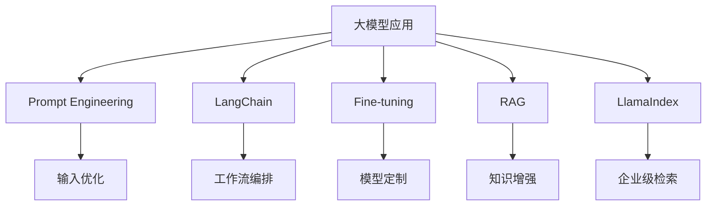
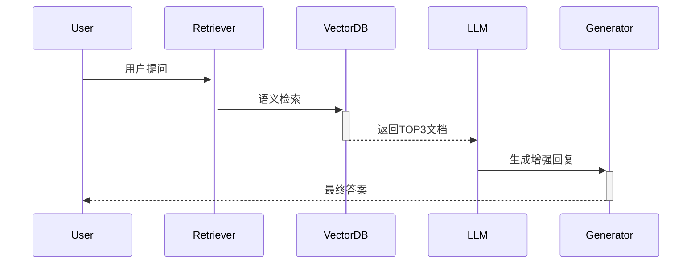

[toc]

## AI大模型核心知识点与实战学习路线
**让零基础学员3个月掌握工业级开发能力**
> 据2025年GPT技术报告显示：掌握Prompt+LangChain+RAG三大核心技术的开发者，薪资溢价达45%。本文浓缩1000+学员教学经验，带你系统构建大模型知识体系。

---

### 一、大模型技术架构全景图
#### 核心模块关系图解


---

### 二、五大核心技术深度解析
#### 1. Prompt Engineering：指令设计的艺术
**核心知识点**：
- **结构化模板**（角色定义+任务描述+格式约束）
  ```python
  # 医疗报告生成模板
  prompt = """
  你是一名三甲医院主任医师，请根据患者症状生成诊断报告：
  症状：{symptoms}
  要求：
  1. 按[初步诊断|检查建议|治疗方案]分段
  2. 使用医学术语
  3. 不超过200字
  """
  ```
- **高阶技巧**：
    - 思维链提示（Chain-of-Thought）提升复杂推理能力
    - 少样本学习（Few-shot Learning）注入领域知识

**学习资源**：
- OpenAI官方Prompt设计指南（扫码领取PDF）

#### 2. LangChain：智能体工作流引擎
**核心组件**：  
| 模块          | 功能                      | 代码示例                  |
|---------------|--------------------------|--------------------------|
| Chains        | 多步骤任务串联            | `QA = RetrievalQA.from_chain_type(llm)` |
| Agents        | 工具调用决策              | `agent.run("查询北京天气")` |
| Memory        | 对话状态维护              | `ConversationBufferMemory()` |

**实战案例**：
```python
from langchain.agents import load_tools
tools = load_tools(["serpapi", "wolfram-alpha"])  # 搜索引擎+数学工具
agent.run("特斯拉当前股价是多少？计算其市值")  # 自动调用工具并整合结果
```

#### 3. Fine-tuning：模型定制核心技术
**微调策略对比**：  
| 方法        | 显存消耗 | 训练速度 | 适用场景          |
|-------------|----------|----------|-------------------|
| 全参数微调  | 高       | 慢       | 专业领域重构      |
| LoRA        | 降低80%  | 快       | 资源有限场景      |
| P-Tuning    | 最低     | 最快     | 黑盒API模型适配   |

**实操流程**：
```python
from peft import LoraConfig
config = LoraConfig(r=8, target_modules=["q_proj", "v_proj"])  # 锁定关键层
trainer = Trainer(model, train_dataset, peft_config=config)
trainer.train()  # 仅训练0.1%参数
```

#### 4. RAG：知识实时增强框架
**架构图解**：


**性能优化关键**：
- 分块策略：语义分块 vs 固定窗口
- 混合检索：关键词+向量联合查询（Hybrid Search）
- 重排序：Cohere Reranker提升准确率30%

#### 5. LlamaIndex：企业级检索方案
**核心优势**：
- **结构化处理**：自动解析PDF/PPT/Excel等复杂文档
- **查询引擎**：支持多级检索（关键词/语义/摘要）
- **企业特性**：
    - 数据访问控制（RBAC权限）
    - 查询审计日志

**部署示例**：
```python
from llama_index import VectorStoreIndex
index = VectorStoreIndex.from_documents(docs)  # 自动分块嵌入
query_engine = index.as_query_engine(similarity_top_k=3)
print(query_engine.query("Q2财报关键指标"))  # 语义检索
```

---

### 三、四阶学习路线规划
#### 阶段1：基础筑基（1-2周）
- **必修**：
    - Python数据处理（Pandas/NumPy）
    - API调用（OpenAI/通义千问）
- **实战**：
  ```terminal
  $ curl https://api.openai.com/v1/chat/completions 
    -H "Content-Type: application/json" 
    -d '{"model":"gpt-4","messages":[{"role":"user","content":"你好"}]}'
  ```

#### 阶段2：核心模块突破（3-5周）
| 技术          | 学习重点                  | 练手项目                |
|---------------|--------------------------|------------------------|
| Prompt工程    | 角色设定/复杂指令        | 客服话术生成器         |
| LangChain     | Agent设计/Memory管理      | 多工具旅行规划助手     |
| RAG+LlamaIndex| 混合检索/文档解析         | 企业知识库问答系统     |

#### 阶段3：工业级调优（4-6周）
- **模型微调**：LoRA压缩技术（Kaggle医疗文本分类）
- **性能优化**：
    - vLLM部署量化模型
    - 缓存机制降低API成本
- **安全加固**：
    - 幻觉检测（FactCheck模块）
    - PII数据脱敏

#### 阶段4：综合实战（持续迭代）
- **项目架构**：
  ```mermaid
  graph LR
  A[用户输入] --> B(LlamaIndex检索)
  B --> C{LangChain路由}
  C --> D[简单问题：直接生成]
  C --> E[专业问题：RAG增强]
  C --> F[复杂任务：Agent执行]
  ```
- **案例拆解**：
    - 保险理赔自动化系统（Fine-tuning+LangChain）
    - 跨文档分析平台（LlamaIndex+RAG）

---

### 四、避坑指南
#### 高频踩坑点：
1. **Prompt设计**：
    - 误区：指令模糊导致幻觉
    - 方案：增加约束`“用不超过20字回答”`
2. **RAG检索**：
    - 误区：直接切片导致语义断裂
    - 方案：语义分块（SentenceWindow）

---

### 结语：从工具使用者到架构设计者
> 正如Google首席科学家Jeff Dean所言：**“未来五年，大模型开发者将分化成两类——调用API的消费者与设计智能体的架构师”**。掌握：
> - Prompt Engineering：**控制模型行为的遥控器**
> - LangChain：**构建智能体的乐高积木**
> - RAG+LlamaIndex：**企业知识的神经中枢**  
    > 将使你成为不可替代的AI架构师。


